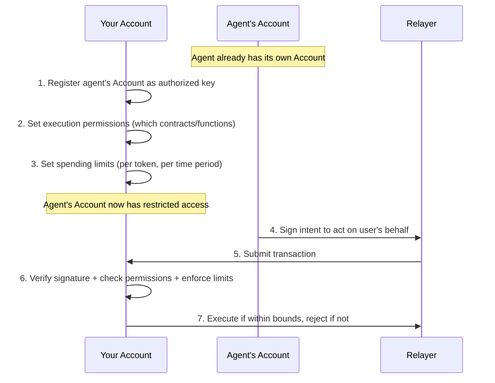
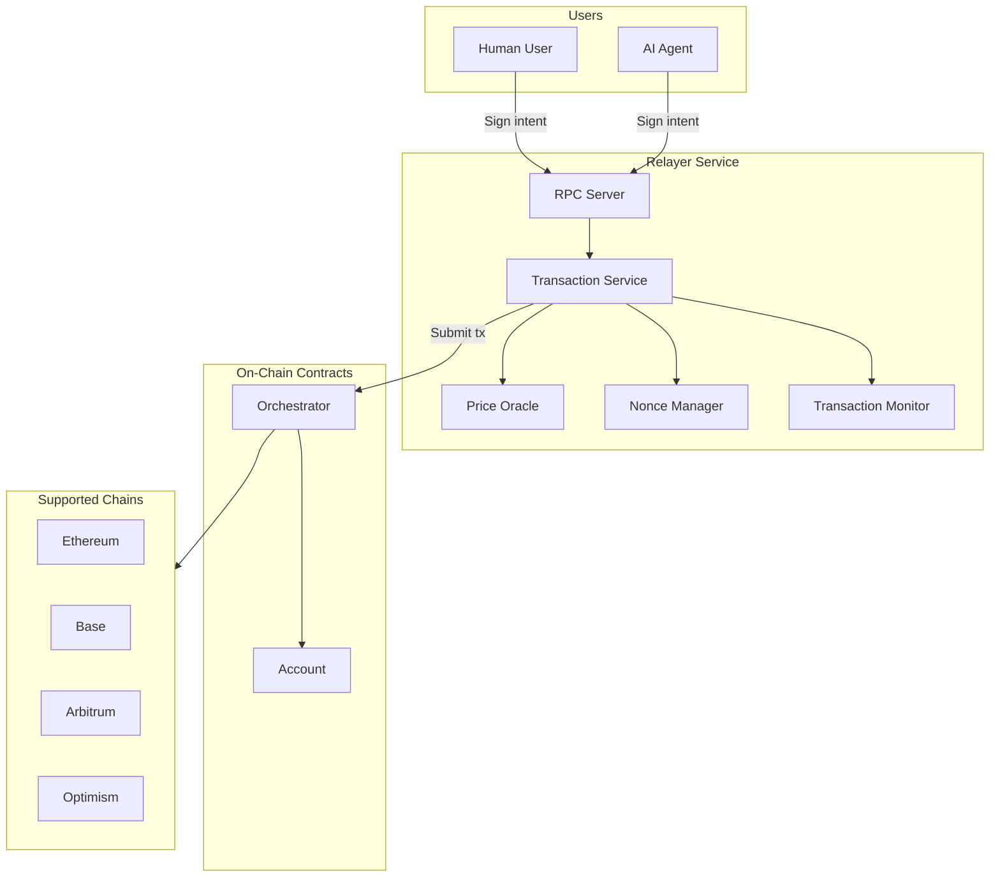
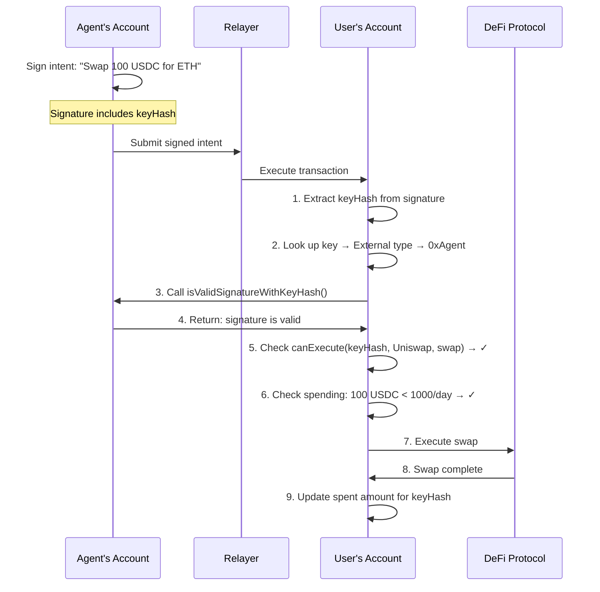

# Relayer

Relayer is the infrastructure layer that powers seamless blockchain interactions for users and AI agents. It abstracts away the complexity of gas management, transaction execution, and account setup so users can focus on outcomes instead of protocol mechanics.

## The Problem

Our current account workflow involved unnecessary friction:

- **Onboarding complexity**: New users need to acquire tokens (ETH, USDC, etc.) just to start using the application, often requiring multiple steps through onramps
- **Gas token management**: Each blockchain requires its specific token for transaction fees—ETH on Ethereum, ETH on Base, etc. Users must maintain balances across every chain they use
- **Multi-step transactions**: Simple actions can require multiple separate transactions, each needing approval and gas
- **Wallet sprawl**: Users end up with multiple wallet connections, different addresses on different chains, and no unified view of their assets

## The Solution

Relayer solves these problems with two core components that work together: **Account** (a smart contract wallet that gives any Ethereum address advanced capabilities) and **Relayer Service** (a backend that handles gas, fees, and execution coordination). Together, they let users and AI agents interact with supported chains through simple signed intents without holding native gas on every network.

## Account

A Account is a smart contract wallet that upgrades any Ethereum address into a powerful, programmable account. Users can sign in with their existing Ethereum wallet or a Privy embedded wallet and immediately gain access to advanced features:

- **Single address, all chains**: Your Account maintains the same address across all supported blockchains. No more juggling different smart account addresses.
- **Spending limits and session keys**: Grant limited permissions to applications without exposing your full account. This is particularly powerful for AI agents.

### How Session Keys Work

A session key allows one Account to authorize another Account (or any other key) to act on its behalf—but only within strict boundaries.

Think of it like giving a valet your car key, but with restrictions: they can only drive to the parking garage (not anywhere else), can only use $20 of gas, and the key stops working after 2 hours.

**Step by step:**

1. **Register an authorized key**: You authorize another account or key to act on behalf of your account.

2. **Set execution permissions**: You specify exactly which smart contracts and functions the authorized key can interact with. For example:
   - "This key can only call Uniswap's `swap` function"
   - "This key can interact with any DeFi protocol" (broader permission)
   - "This key can only transfer USDC to these specific addresses"

3. **Set spending limits**: You define how much the authorized key can spend from your account, broken down by:
   - **Token**: Different limits for different assets (e.g., 100 USDC per day, 0.1 ETH per day)
   - **Time period**: Limits reset on a schedule you choose:
     - Per minute (for high-frequency trading bots)
     - Per hour
     - Per day (most common)
     - Per week
     - Per month
     - Per year
     - Forever (lifetime cap)

4. **Key operates autonomously**: Once configured, the authorized key can sign and submit transactions on your behalf without needing your approval each time—as long as it stays within bounds.

5. **Automatic enforcement**: Your Account smart contract checks every transaction:
   - Is this key authorized to call this contract/function on my behalf?
   - Would this transaction exceed the spending limit I set?
   - If either check fails, the transaction is rejected on-chain.

**Example configuration:**

| Setting           | Value                                                             |
| ----------------- | ----------------------------------------------------------------- |
| Allowed contracts | Uniswap, Aave, Compound                                           |
| Allowed functions | `swap`, `supply`, `withdraw`                                      |
| USDC daily limit  | 1,000 USDC                                                        |
| ETH daily limit   | 0.5 ETH                                                           |
| Cannot call       | `approve` with unlimited amounts, `transfer` to unknown addresses |

**Security guarantees:**

- **No privilege escalation**: An authorized key cannot modify its own permissions or add new authorized keys—only you can do that
- **Approvals are auto-revoked**: If a key approves a contract to spend tokens, that approval is automatically revoked after the transaction batch completes
- **On-chain enforcement**: Limits are enforced by your smart contract, not by trusting the key holder to behave

## Relayer Service

The Relayer Service is the backend that processes user intents and handles the complexity of blockchain transactions:

- **Fee abstraction**: Pay transaction fees in any supported token (USDC, ETH, and other supported tokens). The relayer handles conversion and gas payment automatically. No more scrambling to acquire ETH for gas—if you have USDC, pay in USDC.
- **Transaction orchestration**: Complex multi-step operations are bundled and executed atomically—either everything succeeds or nothing does.
- **Reliable execution**: The relayer handles nonce ordering, retries, and confirmation tracking to keep transactions moving safely.

## AI Agents & Accounts

Here's a key insight: **both users and AI agents are Accounts**. There's no separate system for agents—they use the exact same infrastructure, the same smart contracts, and the same security model as human users.

This unified approach means:

- An agent is just another Account that can interact with your Account
- Agents benefit from the same features: fee abstraction, multi-chain support, spending limits
- The permission system allows one Account (yours) to grant another Account (the agent) limited access to act on your behalf

When you want an AI agent to perform transactions on your behalf—whether it's rebalancing a portfolio, executing DeFi strategies, or managing payments—you grant its Account limited access to yours.

### Granting Access to Agents

With Accounts, you can:

- **Delegate to agents with guardrails**: Set spending limits (per transaction, per day, per token) so an agent can operate autonomously within boundaries you define
- **Use session keys**: Grant temporary permissions that automatically expire, perfect for one-time tasks or time-limited operations
- **Revoke access instantly**: If an agent misbehaves or you no longer need it, revoke its permissions in a single transaction

**Granting an AI agent's Account access to yours:**



For a detailed technical walkthrough of how a user grants an agent access, see [Appendix A: User Grants Agent Access Flow](#appendix-a-user-grants-agent-access-flow).

### For Agent Developers

When an agent is created:

1. **Your agent gets its own Account**: We use the same account creation flow as human users—your agent's private key is delegated to our Account implementation
2. **Same infrastructure, same features**: Your agent benefits from fee abstraction (pay gas in any token), multi-chain support (same address everywhere), and all the security features human users enjoy
3. **Users grant your agent access**: When a user wants to use your agent, they authorize your agent's Account as a session key on their own Account, with spending limits they control
4. **Agents and users are peers**: Both are Accounts interacting with the same system—the only difference is who (or what) controls the private key

This unified model means there's no "second-class citizen" treatment for agents. They're full participants in Agentic Payments, with the same capabilities and protections as human users—just operating under permissions granted by the accounts they serve.

## Key Features

| Feature                     | Description                                                                    |
| --------------------------- | ------------------------------------------------------------------------------ |
| **Pay Fees in Any Token**   | Use USDC, ETH, or any supported token for gas—no ETH hoarding required  |
| **One Address Everywhere**  | Same Account address on Ethereum, Base, Arbitrum, Optimism, and more     |
| **Granular Access Control** | Per-token spending caps, time-based limits, whitelisted contracts, auto-expiry |
| **Deterministic Execution** | Nonce-safe submission, queue-based monitoring, and retry-aware processing      |
| **Agent Delegation**        | Grant AI agents limited, revocable access with on-chain spending enforcement   |

## Why It Matters

### For users

- **Lower barrier to entry**: Start without first acquiring gas tokens on every chain
- **Simplified UX**: One account, one address, one place to manage everything
- **Safer agent interactions**: Delegate to AI agents with confidence, knowing they can only operate within defined limits

### For Developers

- **Faster agent deployment**: Spin up AI agents with built-in wallet functionality and security
- **Multi-network ready**: Build applications that target multiple supported chains with shared relayer infrastructure
- **Focus on product**: Let the relayer handle gas, nonces, and transaction reliability

### For the Ecosystem

- **Mainstream accessibility**: Removes the technical hurdles that prevent everyday users from adopting crypto
- **Agent-ready infrastructure**: As AI agents become more prevalent, Relayer provides the secure, limited-access account model they need

## Technical Foundation

Relayer is built on modern Ethereum standards:

- **EIP-7702**: The smart account standard that allows any EOA (externally owned account) to delegate to a smart contract implementation. This means users don't need to deploy a new contract—their existing address gains smart account capabilities.
- **Non-custodial**: The relayer never has access to user funds. It can only execute transactions that users have explicitly signed. All fund movements are enforced by on-chain smart contracts.
- **Intent-based architecture**: Users sign structured intents (what they want to happen) rather than raw transactions (how to make it happen). This allows the relayer to optimize execution while users retain full control.

## System Architecture



| Component           | Role                                                                              |
| ------------------- | --------------------------------------------------------------------------------- |
| **Account**   | Smart contract wallet with spending limits, session keys, and multi-chain support |
| **Orchestrator**    | Coordinates intent execution, validates signatures, manages nonces                |
| **Relayer Service** | Processes intents, manages fees, monitors transactions, handles retries           |

---

Relayer is the infrastructure that makes blockchain interactions invisible. Users and agents express what they want; the relayer figures out how to make it happen securely and efficiently.

---

## Appendix A: User Grants Agent Access Flow

This appendix provides a detailed technical walkthrough of how a user grants an AI agent's Account permission to act on their behalf.

### Step 1: Agent Already Has an Account

When an agent is created, it gets its own Account:

```
Agent Developer creates agent
    └── Agent has private key
    └── Private key is delegated to Account implementation
    └── Agent's Account address: 0xAgent...
```

The agent's Account works exactly like a human user's account—same smart contract, same features, same security model.

### Step 2: User Authorizes the Agent's Account

When a user wants to use the agent, they add the agent's Account as an authorized key on their own account. This is done by calling `authorize()` with a Key struct:

```
User's Account calls authorize() with:
    ├── keyType: External (meaning "another smart contract")
    ├── publicKey: [Agent's address (20 bytes) + salt (12 bytes)]
    ├── expiry: When access should expire (e.g., 30 days from now)
    └── isSuperAdmin: false (agents should never be super admins)

Returns: keyHash (a unique identifier for this authorization)

Note: the salt is required so we can authorize same agent multiple times with different permissions.
```

The `keyHash` is a unique identifier that links this specific authorization to the agent. All permissions are tied to this `keyHash`.

### Step 3: User Sets Execution Permissions

The user specifies exactly which contracts and functions the agent can call:

```
User's Account calls setCanExecute() for each permission:
    ├── setCanExecute(keyHash, UniswapRouter, "swap", true)
    │   └── Agent can call swap() on Uniswap
    ├── setCanExecute(keyHash, AavePool, "supply", true)
    │   └── Agent can call supply() on Aave
    └── setCanExecute(keyHash, AavePool, "withdraw", true)
        └── Agent can call withdraw() on Aave
```

The system supports wildcards for broader permissions:

- `ANY_TARGET`: Allow this function on any contract
- `ANY_FN_SEL`: Allow any function on this contract

### Step 4: User Sets Spending Limits

The user defines how much the agent can spend, per token and per time period:

```
User's Account calls setSpendLimit() for each limit:
    ├── setSpendLimit(keyHash, USDC, Day, 1000e6)
    │   └── Max 1,000 USDC per day
    ├── setSpendLimit(keyHash, ETH, Week, 0.5 ether)
    │   └── Max 0.5 ETH per week
    └── setSpendLimit(keyHash, USDC, Forever, 10000e6)
        └── Max 10,000 USDC lifetime cap
```

Available time periods: Minute, Hour, Day, Week, Month, Year, Forever.

### Step 5: Agent Acts on User's Behalf

When the agent wants to perform a transaction:



### Step 6: Signature Validation Deep Dive

When the user's Account receives a transaction signed by the agent, here's the validation:

```
1. Unwrap signature to get keyHash
   └── Signature format: [innerSignature + keyHash + prehashFlag]

2. Look up the key by keyHash
   └── Find: Key{ type: External, publicKey: 0xAgent...salt }

3. Since keyType is External, call the agent's contract:
   └── Agent.isValidSignatureWithKeyHash(digest, keyHash, signature)
   └── Agent's Account validates using its own keys
   └── Returns: valid or invalid

4. If valid, check execution permissions:
   └── canExecute(keyHash, targetContract, functionSelector)
   └── Checks exact match, then wildcards (ANY_TARGET, ANY_FN_SEL)

5. Execute the transaction

6. After execution, enforce spending limits:
   └── Track all token outflows (transfers, approvals, balance changes)
   └── Add to spent amount for this keyHash
   └── If exceeds limit → revert entire transaction
```

### Step 7: Revoking Access

If the user wants to remove the agent's access:

```
User's Account calls revoke(keyHash)
    └── Removes the key entirely
    └── All permissions and spending limits are cleared
    └── Agent can no longer act on user's behalf
```

### Security Properties

| Property               | How It's Enforced                                                                  |
| ---------------------- | ---------------------------------------------------------------------------------- |
| **No self-escalation** | Agents cannot call `authorize`, `revoke`, or `setCanExecute` on the user's account |
| **Spending limits**    | Tracked on-chain per keyHash, per token, per time period                           |
| **Approval safety**    | Any ERC20 approvals made during execution are auto-revoked afterward               |
| **Expiration**         | Keys can have an expiry timestamp; expired keys are rejected                       |
| **Revocation**         | User can revoke at any time with a single transaction                              |

### Summary

The entire flow is trustless and on-chain:

1. **Agent has its own Account** — created via the same flow as human users
2. **User authorizes agent's account** — adds it as an External key type
3. **User sets granular permissions** — which contracts, which functions, how much spending
4. **Agent signs, user's account validates** — cross-account signature verification
5. **Limits enforced on every transaction** — spending tracked and capped automatically
6. **User can revoke anytime** — single transaction removes all access

Both participants are Accounts. The permission system simply allows one account to grant another account limited, controlled access to act on its behalf.
